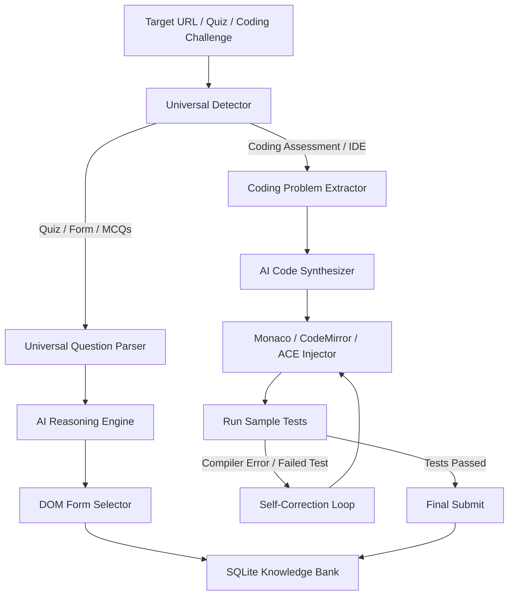

# ⚡ QuizSolver: Universal AI Quiz & Coding Assessment Automator

[](https://www.python.org/downloads/)
[](https://playwright.dev/)
[](https://aistudio.google.com/)
[](https://opensource.org/licenses/MIT)

**QuizSolver** is a modular, autonomous AI platform designed to automatically solve **Academic Quizzes**, **Web Forms**, and **Competitive Coding Challenges** across various platforms.

---

## 🌟 Key Capabilities



- **💻 Multi-Platform Coding Engine:**
  - Solves challenges on **HackerRank, LeetCode, Moodle CodeRunner / VPL, HackerEarth, GeeksforGeeks, Mettl**.
  - Synthesizes optimal code in **Python, C++, Java, C, JavaScript, and SQL**.
  - Directly controls web code editors: **Monaco Editor (VS Code Web)**, **CodeMirror (v5 & v6)**, **ACE Editor**, and native textareas.
  - **Self-Correction & Debug Loop:** Executes sample tests, parses compiler errors and failed test outputs, and automatically refactors code until all test cases pass before final submission.
- **📝 Universal Quiz & Form Solver:**
  - Automated answering across **Moodle LMS, Google Forms, Canvas, Blackboard, Microsoft Forms**, and custom web portals.
  - Handles Single Choice (Radio), Multiple Choice (Checkboxes), True/False, Text Inputs, and Dropdown selects.
- **🧠 Dual AI Engine with Zero-Downtime Fallback:**
  - **Google Gemini** (`gemini-3.5-flash-lite`, `gemini-3.5-flash`, `gemini-3.6-flash`).
  - **NVIDIA NIM** (`meta/llama-3.3-70b-instruct`).
  - Automatic model cascading if a provider experiences high-demand spikes.
- **💾 Local SQLite QA & Code Bank:**
  - Caches solved questions, verified answers, and code solutions locally so repeated attempts score 100% instantly.
- **⚡ Super Fast Headless Mode:**
  - Run with `--fast` and `--headless` to complete 10-question quizzes in under 10 seconds.

---

## 📋 Prerequisites

- **Python 3.10+**
- **uv** (recommended) or **pip**
- **Chromium** (installed automatically via Playwright)

---

## 🛠️ Step-by-Step Installation

### 1. Clone the Repository
```bash
git clone https://github.com/OVERxPOWERED/QuizSolver.git
cd QuizSolver
```

### 2. Create and Activate Virtual Environment
```bash
# Using uv (fastest)
uv venv
source .venv/bin/activate

# Or using standard python venv
python3 -m venv .venv
source .venv/bin/activate
```

### 3. Install Dependencies
```bash
# Using uv
uv pip install -r requirements.txt

# Or using pip
pip install -r requirements.txt
```

### 4. Install Playwright Chromium Browser
```bash
playwright install chromium
```

---

## ⚙️ Configuration (`.env`)

Create your `.env` file by copying `.env.example`:
```bash
cp .env.example .env
```

Open `.env` in your text editor and fill in your settings:

```ini
# ==========================================
# 1. AI Provider Configuration
# ==========================================
# Choose "gemini" (recommended) or "nvidia"
AI_PROVIDER=gemini

# Google Gemini Settings (Get free key at: https://aistudio.google.com/app/apikey)
GEMINI_API_KEY=your_gemini_api_key_here
GEMINI_MODEL=gemini-3.5-flash-lite

# NVIDIA NIM Settings (Get free key at: https://build.nvidia.com)
NVIDIA_API_KEY=your_nvidia_api_key_here
NVIDIA_MODEL=meta/llama-3.3-70b-instruct
NVIDIA_BASE_URL=https://integrate.api.nvidia.com/v1

# ==========================================
# 2. Acropolis / Moodle LMS Credentials (Optional)
# ==========================================
# Network: "internet" (Home: 47.29.0.163) or "campus" (College LAN: 172.16.8.203)
LMS_NETWORK=internet
LMS_USERNAME=your_enrollment_number  # e.g., 0827cs113112
LMS_PASSWORD=your_lms_password       # e.g., Student@123

# ==========================================
# 3. Automation Execution Settings
# ==========================================
# Run browser in background (true) or watch live window (false)
HEADLESS=false

# Automatically submit quizzes/code once solved
AUTO_SUBMIT=true

# Default programming language for coding challenges
CODING_LANGUAGE=python
```

---

## 🚀 Detailed Usage Guide

### Scenario 1: Solve Acropolis / Moodle Course Quizzes

#### A. Interactive Course Selector (Recommended)
```bash
.venv/bin/python main.py
```
- Displays an interactive menu of all enrolled courses.
- Choose a specific course number or select `[A]` to solve all courses in sequence.

#### B. Solve All Courses Silently in Background
```bash
.venv/bin/python main.py --all --headless --fast
```

#### C. Solve a Specific Course by Name
```bash
.venv/bin/python main.py --course "Indian Constitution"
.venv/bin/python main.py --course "Indian Knowledge System"
.venv/bin/python main.py --course "Outcome Based Education"
```

#### D. Force Re-attempting Quizzes to Maximize Score
By default, quizzes already completed with a 100% score are skipped. To force re-attempting:
```bash
.venv/bin/python main.py --reattempt
```

---

### Scenario 2: Solve Any Online Coding Challenge (HackerRank, LeetCode, CodeRunner)

Pass the problem URL directly using the `--url` argument:

#### In Python:
```bash
.venv/bin/python main.py --url "https://www.hackerrank.com/challenges/simple-array-sum/problem" --lang python
```

#### In C++:
```bash
.venv/bin/python main.py --url "https://www.hackerrank.com/challenges/two-sum/problem" --lang cpp
```

#### In Java:
```bash
.venv/bin/python main.py --url "https://leetcode.com/problems/valid-parentheses/" --lang java
```

#### In JavaScript:
```bash
.venv/bin/python main.py --url "<problem_url>" --lang javascript
```

**What the automator does:**
1. Navigates to the challenge page.
2. Extracts problem description, input/output constraints, and sample test cases.
3. Synthesizes an optimal solution with time/space complexity analysis.
4. Programmatically injects the code into **Monaco Editor / CodeMirror / ACE**.
5. Clicks **"Run Code"**, verifies test cases, and self-debugs if any tests fail.
6. Clicks **"Submit Code"**.

---

### Scenario 3: Solve Google Forms & Web Quizzes

Pass the form or quiz URL directly:
```bash
.venv/bin/python main.py --url "https://docs.google.com/forms/d/e/1FAIpQLSc.../viewform"
```

---

## 📖 CLI Arguments Reference

| Flag | Description | Default | Example |
|---|---|---|---|
| `--url <URL>` | Direct URL to any quiz, form, or coding problem | None | `--url "https://..."` |
| `--lang <LANG>` | Target coding language (`python`, `cpp`, `java`, `c`, `javascript`, `sql`) | `python` | `--lang cpp` |
| `--mode <MODE>` | Assessment mode (`auto`, `quiz`, `coding`) | `auto` | `--mode coding` |
| `--all` | Attempt all assigned Moodle target courses sequentially | `False` | `--all` |
| `--course <NAME>` | Specific course name or index to attempt | None | `--course "Indian Constitution"` |
| `--headless` | Run browser silently in background | `False` | `--headless` |
| `--headful` | Run browser in visible interactive window | `True` | `--headful` |
| `--fast` | Eliminates artificial delays for super-fast solving | `False` | `--fast` |
| `--reattempt` | Force re-attempting already completed/passed quizzes | `False` | `--reattempt` |
| `--network <NET>` | Override network mode (`internet` or `campus`) | `internet` | `--network campus` |

---

## 🧪 Running Unit Tests

Run the complete test suite:
```bash
PYTHONPATH=. .venv/bin/pytest tests/ -v
```

---

## 📁 Project Structure

```
QuizSolver/
├── .env                      # Local credentials & API keys (gitignored)
├── .env.example              # Configuration template
├── config.py                 # Pydantic configuration loader & validator
├── main.py                   # Main CLI entry point
├── requirements.txt          # Python dependencies
├── core/
│   ├── ai_solver.py          # AI reasoning, code synthesis, and debugging engine
│   ├── browser.py            # Playwright browser lifecycle manager
│   ├── coding_runner.py      # Coding problem extractor, test execution & debug loop
│   ├── database.py           # Local SQLite question & code cache bank
│   ├── detector.py           # Platform, assessment mode & code editor detector
│   ├── editor_controller.py  # Monaco, CodeMirror, ACE & Textarea code injector
│   ├── lms_client.py         # Moodle navigation & course discovery
│   ├── question_parser.py    # Universal question and choice parser
│   └── quiz_runner.py        # Multi-page quiz execution & learning engine
├── utils/
│   ├── helpers.py            # Text cleaners, hashing, and fuzzy matchers
│   └── logger.py             # Rich console logger with tables & badges
└── tests/
    ├── test_coding_solver.py # Unit tests for coding solver & self-debugging
    └── test_components.py   # Unit tests for text normalization, hashing & cache
```

---

## 📄 License

This project is licensed under the MIT License - see the [LICENSE](LICENSE) file for details.

---

## ⚠️ Disclaimer

This tool is created for educational, research, and productivity automation purposes. Please ensure compliance with the academic integrity guidelines and terms of service of any assessment platform you use it on.
